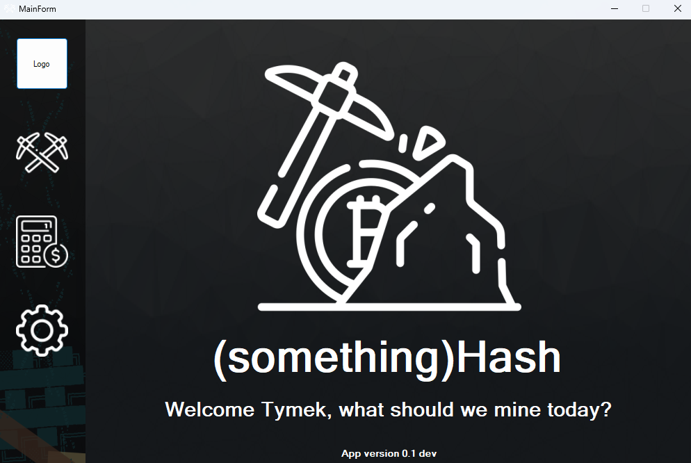
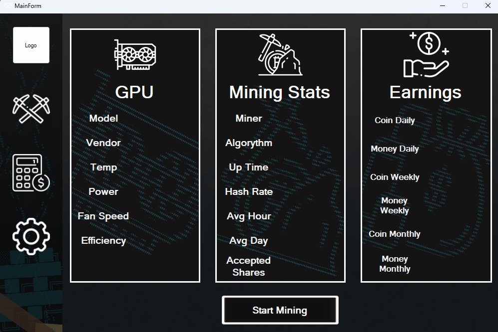
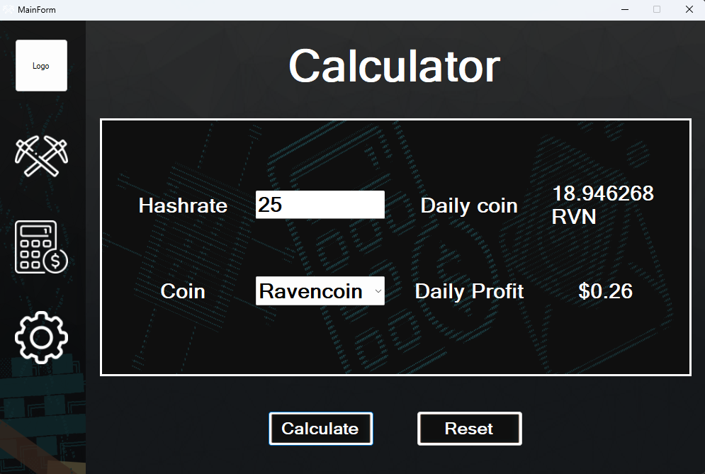
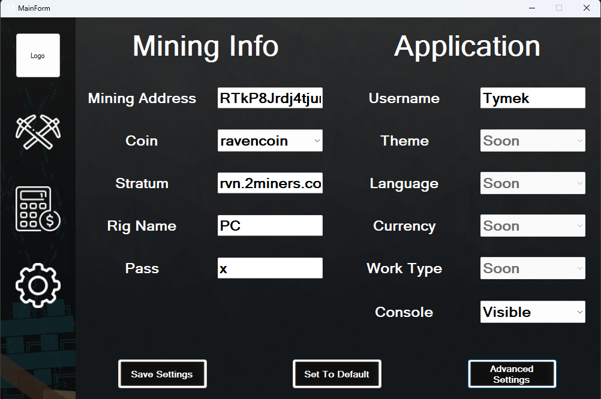

# THIS IS AN OLD PROJECT
This repository won't be maintained, it is published for preservation.
I hope this project helps in whatever you are currently developing.

---
# (Un)Name(d) Hash
This application was developed in late 2021 by [Dawid "Dexston123" Trzcionka](https://github.com/Dexston123) and [Tymoteusz "TymekTM" Bielski](https://github.com/TymekTM) with a goal of simplifying the process of mining cryptocurrency.

Developed entirely without the use of artificial intelligence, this project was a great way to improve our programming skills, while still in school. Everything included in this repository was hand written (or created). While the code may not follow modern best practices, it was a valuable learning experience from our early programming days.

# Features

## Mining
With one simple button you can start mining in seconds, the GUI present most important information about your:
- GPU
- Mining session
- Current profitability 

> [!warning] State of mining
> As of September 2025 with changed t-rex api mining no longer works.

## Calculator
Calculate daily profit based on current token price, mining difficulty and your hash-rate. Data is provided via coingecko API.

## Settings
Settings were a way to just paste your wallet and mining pool address. The biggest ease of use in this app. Original t-rex miner required modifying settings via CLI parameters, some of them were non logical, so this was easier way to do it.

---
## Tech stack
- C# (.NET Framework 4.8)
- T-Rex Miner
- CoinGecko API